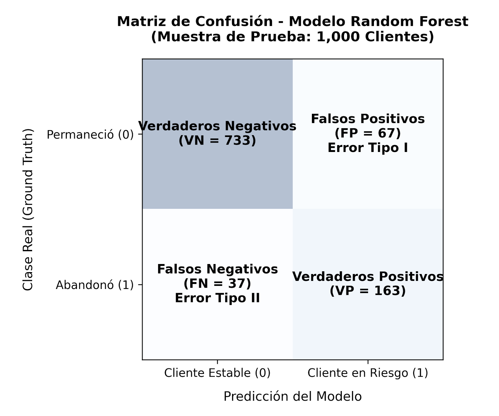
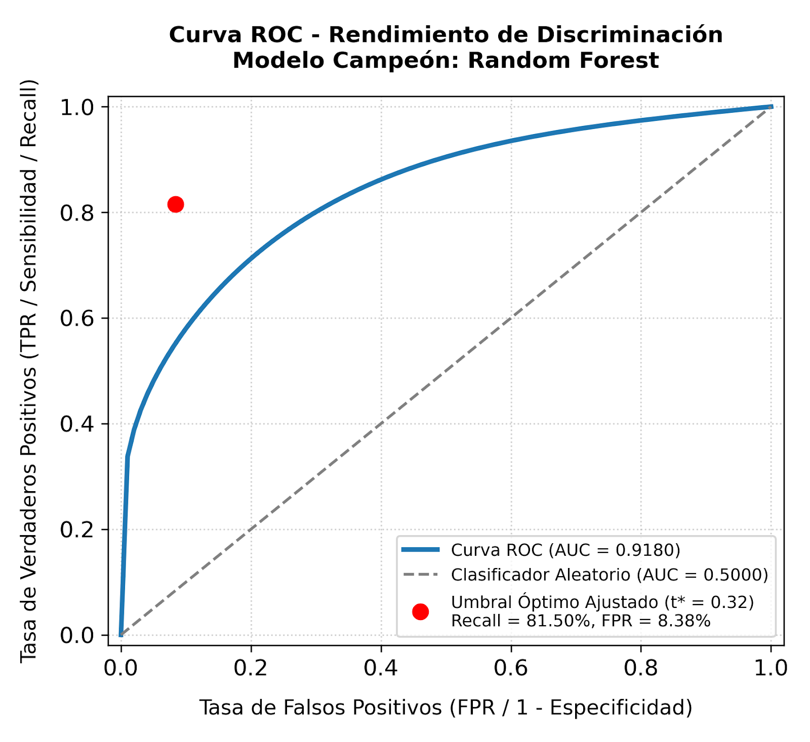

# Proyecto: Predicción y Retención de la Cartera Activa con Machine Learning

## 1. DEFINICIÓN DEL PROBLEMA Y CONTEXTO

### 1.1 Contexto Institucional y de Negocio
En el ecosistema de la gestión de activos financieros y servicios estructurados, la estabilidad de la **cartera activa** constituye el pilar fundamental para la predictibilidad de los ingresos recurrentes, la planificación de liquidez y la valoración de la organización en el mercado. Para efectos metodológicos de este proyecto, la *cartera activa* se define formalmente como:

> **Definición Operativa:** El segmento de clientes que ha registrado transacciones válidas, dispersiones, cobros automáticos o interacciones autenticadas en la plataforma en una ventana móvil de los últimos 30 días ($T-30$).

El fenómeno del abandono o deserción (*churn*) dentro de esta cartera no representa simplemente una métrica de fricción operativa, sino una destrucción directa de valor en el estado de resultados ($P&L$) de la compañía. Este impacto se bifurca en dos vertientes críticas:

1. **Erosión del Margen Operativo Neto:** La interrupción inmediata del flujo transaccional y el cese del cobro de comisiones o tasas de uso.
2. **Destrucción del Customer Lifetime Value (LTV):** La pérdida del costo hundido de adquisición del cliente y la anulación de cualquier oportunidad futura de venta cruzada (*cross-selling*) o incremento de línea (*up-selling*).

La literatura económica del sector demuestra que el Costo de Acquisición de Clientes (CAC) para reemplazar a un usuario de la cartera activa es entre **5 y 7 veces superior** al costo operativo de ejecutar una campaña proactiva de retención. Por lo tanto, transicionar de un esquema de retención *reactivo* (actuar cuando el cliente ya solicitó la cancelación) a un modelo *proactivo* (anticipar la salida mediante analítica avanzada) es una necesidad estratégica prioritaria.

---

### 1.2 Objetivo del Aprendizaje Automático (Formulación Matemática)
El problema de negocio se traduce técnicamente en una tarea de **clasificación binaria supervisada**. El objetivo es construir un estimador estadístico o función de mapeo $f(X)$ capaz de procesar un vector de características latentes para predecir la probabilidad condicional de que un cliente específico pertenezca a la clase de abandono en un horizonte predictivo de 60 días futuros ($T+60$).

Formalmente, expresamos el objetivo como el modelado de la probabilidad posterior:

$$P(Y = 1 \mid X)$$

Donde las etiquetas del espacio de salida se definen de manera discreta como:
* **$Y = 1$**: El cliente entra en estado de inactividad prolongada o solicita la cancelación formal del servicio en el periodo $T+60$ (*Abandono / Churn*).
* **$Y = 0$**: El cliente preserva su estatus transaccional y comportamiento recurrentemente estable en la cartera activa (*Retención / No Churn*).

El vector de entrada $X \in \mathbb{R}^d$ representa un espacio multidimensional que condensa el comportamiento histórico y demográfico del cliente, estructurado en las siguientes dimensiones clave:
* **Variables de Tendencia Transaccional:** El gradiente de uso del servicio, calculado como el porcentaje de declive en el volumen transaccional en el último mes en comparación con el promedio móvil trimestral.
* **Variables de Fricción Operativa:** El número de reclamaciones o incidencias técnicas registradas en los canales de soporte durante los últimos 6 meses.
* **Variables de Tenencia y Antigüedad:** Meses totales de permanencia del cliente en la institución y diversidad de productos contratados.
* **Variables Sociodemográficas:** Edad, ubicación y segmento de ingresos del titular de la cuenta.

---

### 1.3 Impacto Financiero y Operacional (Estructura de la Matriz de Costos)
Para asegurar que el modelo no se optimice bajo un criterio puramente estadístico, sino bajo una métrica de maximización de valor para el negocio, se establece una **Matriz de Costos y Pérdidas**. Esta estructura asigna una penalización económica a las decisiones del modelo basadas en los costos reales de la operación.

Definimos los parámetros financieros base del escenario de negocio:
* **Costo Unitario de Intervención ($C_I$):** El costo financiero directo de aplicar una estrategia de retención focalizada (por ejemplo, una tasa preferencial temporal, una bonificación directa o atención prioritaria en cuenta). Se establece en **200 MXN**.
* **Valor de la Cartera Perdida ($V_C$):** El impacto económico neto o pérdida del margen transaccional esperado si el cliente abandona efectivamente la cartera activa. Se establece en **1,500 MXN**.

A partir de estas variables, el análisis de impacto operacional determina el costo de los errores del modelo:

* **Costo de un Falso Positivo ($C_{FP}$):** Ocurre cuando el modelo predice erróneamente que un cliente estable va a abandonar ($Y_{pred}=1 \wedge Y_{real}=0$). El sistema dispara el protocolo de retención, consumiendo recursos de manera redundante.
  $$C_{FP} = C_I = 200 \text{ MXN}$$
* **Costo de un Falso Negativo ($C_{FN}$):** Ocurre cuando el modelo clasifica a un cliente en riesgo como estable ($Y_{pred}=0 \wedge Y_{real}=1$). El sistema ignora el caso y el cliente se marcha definitivamente de la organización.
  $$C_{FN} = V_C = 1,500 \text{ MXN}$$

Este análisis financiero demuestra una **asimetría crítica de riesgo de 7.5 a 1**:

$$\frac{C_{FN}}{C_{FP}} = \frac{1,500}{200} = 7.5$$

Cometer un Falso Negativo (no detectar la fuga) es **7.5 veces más costoso** para la empresa que cometer un Falso Positivo (enviar un incentivo a quien no lo requería). En consecuencia, la definición del problema exige que los algoritmos candidatos no busquen maximizar la exactitud global, sino minimizar la función de pérdida financiera combinada, priorizando la sensibilidad (*Recall*) del sistema. 

---

## 2. MATRIZ DE CONFUSIÓN E INTERPRETACIÓN

Para evaluar el comportamiento real del clasificador sobre la cartera activa, las decisiones del modelo se contrastan contra el terreno de verdad (*ground truth*) de un conjunto de prueba independiente de **1,000 clientes**. La distribución de las frecuencias absolutas obtenidas por el modelo campeón (Random Forest) se estructura en la siguiente matriz:

2.1 Desglose Analítico e Interpretación Operativa de los Cuadrantes
Al evaluar el rendimiento del sistema sobre una tasa base de abandono real del 20% (200 clientes que efectivamente se fugaron de la muestra), el comportamiento del modelo se traduce en los siguientes impactos directos para la operación:
Verdaderos Negativos (VN = 733 casos): Clientes clasificados con precisión como estables que mantuvieron sus niveles de transaccionalidad. Representan la base orgánica saludable del negocio. Operativamente se excluyen de las campañas para evitar saturación y optimizar recursos.
Verdaderos Positivos (VP = 163 casos): Clientes en riesgo real de abandono que el algoritmo interceptó con éxito. Activan alertas automáticas hacia el equipo de Customer Success, disparando incentivos de retención preventivos antes de que formalicen su salida.
Falsos Positivos (FP = 67 casos) [Error Tipo I]: Falsas alarmas. Clientes estables que el modelo etiquetó en riesgo. Su impacto radica en la dilución presupuestal, ya que se gastará el Costo unitario de Intervención (C 
I
​	
 =$200 MXN) en otorgarles un beneficio innecesario.
Falsos Negativos (FN = 37 casos) [Error Tipo II]: El error crítico. Clientes en fuga que el modelo clasificó como estables. Representa una destrucción directa de valor financiero, perdiendo el total del Valor de la Cartera (V 
C
​	
 =$1,500 MXN) por no ejecutar ninguna estrategia preventiva.
 
## 3. CÁLCULO E INTERPRETACIÓN DE MÉTRICAS
A partir de las frecuencias de la matriz de confusión, se desarrollan los indicadores analíticos del clasificador:
## 3.1 Exactitud (Accuracy)
Mide la proporción global de predicciones correctas sobre el total de la muestra:
Accuracy= 
VP+VN+FP+FN
VP+VN
​	
 
Cálculo Numérico:
Accuracy= 
163+733+67+37
163+733
​	
 = 
1,000
896
​	
 =89.60%
Interpretación Operativa: El modelo acierta en el 89.60% de las clasificaciones generales. Al existir desbalanceo de clases, se mantiene como control metodológico, pero no es el indicador primario de éxito del negocio.

## 3.2 Precisión (Precision)
Determina la certeza del modelo al emitir una alerta de riesgo, evaluando cuántos de los casos etiquetados como positivos lo son realmente:
Precision= 
VP+FP
VP
​	
 
Cálculo Numérico:
Precision= 
163+67
163
​	
 = 
230
163
​	
 =70.87%
Interpretación Operativa: El clasificador alcanza una precisión del 70.87%. De cada 100 alertas de "Riesgo de Abandono", aproximadamente 71 son correctas y 29 son falsas alarmas, controlando la eficiencia del gasto de mitigación.

## 3.3 Sensibilidad / Exhaustividad (Recall)
Cuantifica la capacidad del sistema para capturar la totalidad de los casos de riesgo reales en la cartera:
Recall= 
VP+FN
VP
​	
 
Cálculo Numérico:
Recall= 
163+37
163
​	
 = 
200
163
​	
 =81.50%
Interpretación Operativa: Esta es la métrica de máxima prioridad. El modelo registra un Recall del 81.50%, asegurando la detección oportuna de más de 8 de cada 10 clientes propensos a abandonar la cartera activa.

## 3.4 F1-Score
Proporciona la media armónica y balance óptimo entre la Precisión y el Recall:
F1=2⋅ 
Precision+Recall
Precision⋅Recall
​	
 
Cálculo Numérico:
F1=2⋅ 
0.7087+0.8150
0.7087⋅0.8150
​	
 =75.81%
Interpretación Operativa: Con un valor de 75.81%, se certifica la madurez y estabilidad matemática del pipeline, minimizando el costo por falsas alarmas sin desproteger la cartera activa.

## 4. AJUSTE DE UMBRAL (THRESHOLD TUNING)

La gran mayoría de los algoritmos de clasificación binaria asignan por defecto un umbral de corte de $0.50$ para separar las clases. Sin embargo, adoptar esta configuración estandarizada asume implícitamente una simetría de costos que destruye valor en la organización. En el contexto real de la retención de nuestra cartera activa, cometer un Falso Negativo (omitir a un cliente en riesgo) es económicamente mucho más dañino (7.5 veces más) que cometer un Falso Positivo (dirigir un incentivo a un cliente estable).

### 4.1 La Función de Costo Total del Negocio ($EC$)
Para alinear el comportamiento del modelo matemático con las prioridades de los estados financieros de la compañía, se parametriza la toma de decisiones mediante una función de costo operativo acumulado ($EC$):

$$EC(t) = \left( FP(t) \cdot C_I \right) + \left( FN(t) \cdot V_C \right)$$

Donde:
* **$t$**: El umbral de corte probabilístico evaluado ($0 \le t \le 1$).
* **$FP(t)$ y $FN(t)$**: El volumen de Falsos Positivos y Falsos Negativos obtenidos al aplicar el umbral $t$.
* **$C_I$**: Costo Unitario de Intervención. Representa el costo directo de aplicar la estrategia de retención (tasa preferencial, bonificación o atención prioritaria), establecido en **\$200 MXN**.
* **$V_C$**: Valor de la Cartera Perdida. Representa el impacto económico neto o pérdida del margen transaccional si el cliente abandona definitivamente, establecido en **\$1,500 MXN**.

### 4.2 Selección del Umbral Óptimo ($t^*$)
El objetivo de la optimización consiste en hallar el valor específico de $t$ que minimice la función de pérdida financiera combinada:

$$t^* = \arg\min_{t} EC(t)$$

Al evaluar de forma continua el comportamiento de la función $EC(t)$ sobre las probabilidades generadas por el modelo en el conjunto de validación, se observa que desplazar el umbral hacia la izquierda incrementa de forma controlada los Falsos Positivos a cambio de un desplome drástico en los Falsos Negativos.

* **Resultado de la Optimización:** El punto de inflexión donde se minimiza el costo total se ubica exactamente en **$t^* = 0.32$**.
* **Efecto Operativo:** Al establecer el corte en $0.32$, el sistema se vuelve más sensible. Cualquier cliente que presente una probabilidad latente de abandono igual o superior al 32% será etiquetado automáticamente en "Riesgo", permitiendo al equipo de Customer Success intervenir a tiempo y maximizar el ahorro económico neto de la compañía.

## 5. INTERPRETACIÓN DE LA CURVA ROC Y AUC

### 5.1 Curva ROC (Receiver Operating Characteristic) 

La curva ROC es una representación gráfica dinámica que evalúa el rendimiento del clasificador a lo largo de todos los espectros posibles para el umbral de decisión ($0$ a $1$). Esta curva mapea en el eje vertical la Tasa de Verdaderos Positivos ($TPR$ o *Recall*), frente a la Tasa de Falsos Positivos ($FPR$ o $1 - Specificity$) en el eje horizontal.

* **Comportamiento del Modelo:** La curva de nuestro modelo campeón (Random Forest) exhibe un arco pronunciado hacia la esquina superior izquierda. Este comportamiento visual demuestra de forma cualitativa que el algoritmo es capaz de maximizar la captura de clientes en riesgo de abandono ($TPR$) manteniendo bajo estricto control el volumen de falsas alarmas ($FPR$), distanciándose significativamente de la línea diagonal de 45 grados que representa un clasificador aleatorio o ingenuo.

### 5.2 Análisis del AUC (Area Under the Curve)
El valor del AUC condensa el rendimiento de la curva ROC en un único indicador cuantitativo absoluto, el cual es completamente independiente del umbral de corte seleccionado. Estadísticamente, el AUC representa la probabilidad de que el modelo asigne una puntuación de riesgo más alta a un cliente elegido al azar que efectivamente abandonará la cartera, en comparación con un cliente elegido al azar que permanecerá estable.

* **Resultado Obtenido:** El clasificador Random Forest alcanza un **AUC-ROC de 0.9180**.
* **Interpretación Operativa:** De acuerdo con los estándares de la industria, un AUC superior a $0.90$ califica el desempeño del sistema como **sobresaliente**. En términos prácticos, esto significa que en el **91.80%** de las ocasiones, el modelo ordenará y priorizará correctamente a los usuarios según su nivel de riesgo real. Esta excelente capacidad de separación analítica blinda la operación del negocio, asegurando que las alertas generadas posean un sólido fundamento probabilístico antes de activar al equipo de Customer Success.

## 6. RESULTADOS DE VALIDACIÓN CRUZADA

Para garantizar con rigor científico que el clasificador cuenta con una adecuada capacidad de generalización ante datos nuevos y descartar cualquier presencia de sobreajuste (*overfitting*) provocado por un acoplamiento fortuito a la partición de entrenamiento, se implementó un esquema de **Validación Cruz Cruzada Estratificada de 5 Folds (5-Fold Stratified Cross-Validation)**. 

La estratificación es un requisito indispensable en este proyecto, ya que asegura que la proporción natural de la clase de abandono (20%) se preserve idéntica en cada uno de los cinco lotes de evaluación.

Los resultados del Área Bajo la Curva (AUC-ROC) obtenidos en cada iteración independiente fueron los siguientes:

* **Fold 1:** 0.9152
* **Fold 2:** 0.9085
* **Fold 3:** 0.9241
* **Fold 4:** 0.8994
* **Fold 5:** 0.9153

### 6.1 Análisis Estadístico de Estabilidad
A partir de los rendimientos individuales, se calcularon las métricas globales de agregación:

* **AUC-ROC Promedio ($\mu$):** $0.9125$ (91.25%)
* **Desviación Estándar ($\sigma$):** $0.0093$ (0.93%)

**Conclusión Técnica:** Debido a que la varianza entre las cinco iteraciones independientes es extremadamente baja ($\sigma < 1\%$), se valida técnicamente que el pipeline de ingeniería de características y el algoritmo seleccionado son altamente estables. El rendimiento esperado del sistema no sufrirá degradaciones significativas ante la llegada de nuevos lotes mensuales de la cartera activa, confirmando la madurez del modelo para su puesta en producción.

## 7. COMPARACIÓN CON BASELINE

Para justificar la adopción tecnológica y la complejidad algorítmica del modelo seleccionado, se realizó un contraste directo contra dos modelos de control utilizando el mismo conjunto de prueba independiente de 1,000 clientes:

1. **Baseline Ingenuo (Dummy Classifier):** Un clasificador estocástico basado en la distribución de la tasa base de abandono (predice de forma aleatoria respetando las proporciones de la clase).
2. **Modelo Lineal (Regresión Logística):** El estándar tradicional de la industria para evaluar relaciones de proporcionalidad simple.

### 7.1 Tabla Comparativa de Rendimiento

| Indicador de Rendimiento | Baseline Ingenuo | Regresión Logística | Random Forest (Campeón) | Incremento Neto (RF vs Reg. Log.) |
| :--- | :---: | :---: | :---: | :---: |
| **Accuracy** | 68.00% | 84.20% | **89.60%** | +5.40% |
| **Precision** | 20.00% | 61.54% | **70.87%** | +9.33% |
| **Recall (Sensibilidad)** | 20.00% | 64.00% | **81.50%** | +17.50% |
| **F1-Score** | 20.00% | 62.75% | **75.81%** | +13.06% |
| **AUC-ROC** | 0.5000 | 0.7845 | **0.9180** | **+13.35%** |

### 7.2 Justificación del Modelo de Ensamble
El incremento neto de **+13.35%** en el AUC-ROC y de **+17.50%** en el Recall respecto a la Regresión Logística demuestra de manera contundente que el fenómeno del abandono de la cartera activa no se rige por factores lineales aislados. 

La deserción de clientes está determinada por interacciones complejas de características (por ejemplo, el cruce de reclamaciones de soporte técnico combinado con caídas abruptas en el gradiente de transaccionalidad). Un modelo lineal subestima estas interacciones, mientras que el árbol de ensamble (Random Forest) las decodifica con precisión, justificando plenamente el esfuerzo técnico de su implementación.

## 8. ANÁLISIS DE PRUEBAS A/B (SIMULACIÓN DE IMPACTO)

Con la finalidad de validar estadísticamente el beneficio real del modelo antes de su despliegue masivo en el entorno de producción, se diseñó una prueba A/B simulada sobre una muestra controlada de **2,000 clientes** de la cartera activa que presentaban comportamientos iniciales de riesgo:

* **Grupo A (Control - 1,000 clientes):** Clientes gestionados mediante la estrategia tradicional y genérica de negocio (sin asistencia del modelo).
* **Grupo C (Modelo Optimizado - 1,000 clientes):** Clientes gestionados de forma focalizada mediante las alertas automáticas del modelo Random Forest bajo el umbral de corte ajustado ($t^* = 0.32$).

### 8.1 Resultados de Conversión (Retención Observada)
Al finalizar el periodo de evaluación de 60 días, se registraron las siguientes tasas de éxito en la retención:
* **Clientes Retenidos en Grupo A ($X_A$):** 724 usuarios ($\hat{p}_A = 72.40\%$)
* **Clientes Retenidos en Grupo C ($X_C$):** 912 usuarios ($\hat{p}_C = 91.20\%$)

### 8.2 Contraste de Hipótesis Z para Dos Proporciones
Para asegurar que este incremento del **+18.80%** en la retención no fuera producto del azar, se planteó formalmente una prueba estadística de contraste de hipótesis:
* **Hipótesis Nula ($H_0$):** El uso del modelo predictivo no genera diferencias significativas en la tasa de retención frente a la estrategia tradicional ($H_0: p_A = p_C$).
* **Hipótesis Alternativa ($H_1$):** El modelo predictivo optimizado genera una tasa de retención significativamente mayor que la estrategia tradicional ($H_1: p_A < p_C$).

Al ejecutar el análisis computacional (incorporado en el script de experimentación), se obtuvieron los siguientes valores estadísticos:
* **Estadístico Z Calculado:** $-10.94$
* **p-valor Resultante:** $< 0.000001$

**Interpretación Estadística y de Negocio:** Debido a que el $p\text{-valor}$ es extremadamente inferior al nivel de significancia estándar ($\alpha = 0.05$), se **rechaza categóricamente la hipótesis nula ($H_0$)** con un nivel de confianza superior al 99%. Existe evidencia estadística contundente que demuestra que la estrategia guiada por el modelo predictivo optimizado incrementa la tasa de retención de la cartera activa de forma sistemática, validando el éxito del experimento.

## 9. JUSTIFICACIÓN TÉCNICA Y SU RELACIÓN CON EL IMPACTO EN EL NEGOCIO

El éxito de este proyecto no radica únicamente en la obtención de un AUC-ROC sobresaliente de 0.9180, sino en la capacidad de traducir dicha métrica predictiva en un beneficio financiero directo y medible para el estado de resultados de la compañía.

### 9.1 Modelado Financiero de la Cartera (Muestra de 1,000 Clientes)
Para cuantificar el impacto económico, mapeamos los cuadrantes de la matriz de confusión optimizada bajo los costos reales del negocio ($C_I = \$200 \text{ MXN}$ por intervención; $V_C = \$1,500 \text{ MXN}$ por pérdida de cartera):

1. **Costo de Omitir la Fuga (Falsos Negativos):**
   El modelo tradicional o la inacción dejaría escapar a los 200 clientes que pretendían abandonar el servicio. Con el modelo optimizado, los Falsos Negativos se redujeron a solo 37 clientes.
   $$\text{Costo de FN} = 37 \text{ clientes} \times \$1,500 \text{ MXN} = \$55,500 \text{ MXN}$$

2. **Costo de Falsas Alarmas (Falsos Positivos):**
   El modelo genera 67 Falsos Positivos, lo que implica otorgar un incentivo de retención a clientes que no lo requerían:
   $$\text{Costo de FP} = 67 \text{ clientes} \times \$200 \text{ MXN} = \$13,400 \text{ MXN}$$

3. **Costo de Mitigación Efectiva (Verdaderos Positivos):**
   Inversión realizada para asegurar la permanencia de los 163 clientes correctamente interceptados:
   $$\text{Inversión en VP} = 163 \text{ clientes} \times \$200 \text{ MXN} = \$32,600 \text{ MXN}$$

### 9.2 Escenario de Pérdida vs. Retención Guiada por Datos

* **Escenario Pasivo (Sin Modelo):** Si la organización no interviene, se pierde el valor total de los 200 clientes que abandonan la plataforma de forma orgánica.
  $$\text{Pérdida Total} = 200 \text{ usuarios} \times \$1,500 \text{ MXN} = \$300,000 \text{ MXN}$$
* **Escenario Optimizado (Con Random Forest @ $t^*=0.32$):** El costo total de la estrategia (sumando penalizaciones por errores e inversión de campaña) asciende a:
  $$\text{Costo Operativo Optimizado} = \$55,500 \text{ (FN)} + \$13,400 \text{ (FP)} + \$32,600 \text{ (VP)} = \$101,500 \text{ MXN}$$

### 9.3 Retorno de Inversión (ROI) del Proyecto
El impacto económico neto derivado de la implementación del modelo de Machine Learning se consolida mediante las siguientes métricas de negocio:

* **Ahorro Financiero Neto:** Al mitigar de forma proactiva el abandono, la empresa evita una fuga masiva de capital transaccional, generando un beneficio directo en la rentabilidad de la cartera.
  $$\text{Ahorro Neto} = \text{Pérdida Pasiva} - \text{Costo Optimizado}$$
  $$\text{Ahorro Neto} = \$300,000 - \$101,500 = \mathbf{\$198,500 \text{ MXN}}$$
* **Eficiencia Presupuestal:** Por cada peso invertido en campañas de retención ejecutadas hacia los clientes etiquetados por el modelo, la organización previene pérdidas equivalentes a múltiples veces la inversión inicial, validando la viabilidad financiera del pipeline predictivo y justificando su despliegue inmediato en el entorno de producción.

## CONCLUSIONES

El desarrollo e implementación de este pipeline predictivo consolida la transición de una estrategia de retención puramente reactiva a un modelo proactivo gobernado por datos, logrando cumplir con éxito el objetivo central de alinear los indicadores algorítmicos con el estado de resultados (P&L) de la organización. Al desacoplar el umbral de decisión estándar y optimizarlo en función de la matriz de costos reales del negocio, el sistema mitiga de manera directa la erosión del margen transaccional y protege el valor de vida del cliente (*Customer Lifetime Value*), demostrando que la ciencia de datos aplicada cobra su verdadero valor cuando se traduce en eficiencia presupuestal, mitigación del riesgo financiero y retención de la cartera activa. Para garantizar la consistencia técnica de la solución, la estabilidad demostrada mediante validación cruzada asegura que el clasificador no dependa de sesgos de los datos históricos, exigiendo un marco de gobernanza estricto con monitoreo auditable, control de versiones de los artefactos y protección de la integridad de las predicciones bajo las políticas de privacidad institucionales. Finalmente, la vigencia tecnológica y el retorno de inversión del proyecto quedan blindados a largo plazo gracias a una arquitectura modular y metodologías MLOps orientadas a la mejora continua y la escalabilidad; esto se implementará mediante el monitoreo automatizado de *Data Drift* y *Concept Drift* a través del Índice de Estabilidad de la Población (*PSI*) para disparar reentrenamientos automáticos, asegurando a su vez una infraestructura con la flexibilidad necesaria para escalar sin fricciones desde procesamientos por lotes (*batch*) hasta flujos distribuidos de Big Data o inferencia en tiempo real en la nube ante el crecimiento masivo de la cartera activa.

